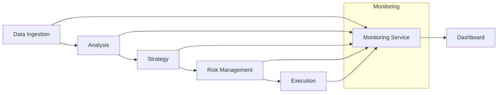

# Trading Platform Service Purposes
[Last Updated: 2024-11-15]

## LLM INSTRUCTIONS
When updating this document:
- Maintain consistent service naming across all documentation
- Add implementation status (✓, 🔄, 📋) for each service
- Include port numbers for each service
- Document API endpoints with clear versioning
- Note dependencies between services
- Highlight security boundaries
- Keep communication patterns updated
- Document rate limits and throttling
- Note service health endpoints
- Include fallback strategies
- Document circuit breaker patterns
- Maintain clear data flow descriptions
- Tag sensitive operations

## Core Services Overview

### 1. Data Ingestion Service 🔄
**Port**: 8082
**Purpose**: Collects and integrates real-time and historical market data from various sources. Acts as the primary data entry point for the entire system.
**Status**: In active development
**Key Endpoints**:
- `/api/v1/data/timeseries` - Real-time market data
- `/api/v1/data/ws` - WebSocket connection for live updates
  **Dependencies**: None (Entry point service)

### 2. Analysis Service 🔄
**Port**: 8083
**Purpose**: Processes and analyzes market data to generate insights. Handles technical analysis, data preprocessing, and feature engineering from raw market data.
**Status**: In development
**Dependencies**: Data Ingestion Service
**Circuit Breaker**: Implemented for data ingestion connection

### 3. Strategy Service 📋
**Port**: 8084
**Purpose**: Implements and executes trading strategies. Makes trading decisions based on analyzed data and generates trading signals.
**Status**: Planned
**Dependencies**: Analysis Service
**Security**: Requires authentication for strategy modification

### 4. Execution Service 📋
**Port**: 8085
**Purpose**: Manages the execution of trades. Handles order management and interfaces with various exchanges to execute trading decisions.
**Status**: Planned
**Dependencies**: Strategy Service, Risk Management Service
**Security**: Requires additional authentication for trade execution

### 5. Risk Management Service 📋
**Port**: 8086
**Purpose**: Ensures trades adhere to risk management rules. Handles position sizing, stop-loss management, and risk assessment for all trading activities.
**Status**: Planned
**Dependencies**: Strategy Service
**Critical Operations**: Position sizing, stop-loss enforcement

### 6. Monitoring Service ✓
**Port**: 8087
**Purpose**: Tracks and analyzes system performance. Provides real-time visibility into service health, trading performance, and system metrics.
**Status**: Basic implementation complete
**Endpoints**:
- `/actuator/health` - Service health checks
- `/actuator/metrics` - Performance metrics

### 7. Backtesting Service 📋
**Port**: 8088
**Purpose**: Simulates and tests trading strategies using historical data. Enables strategy validation and optimization before live deployment.
**Status**: Planned
**Dependencies**: Data Ingestion Service, Strategy Service
**Resource Intensive**: Requires throttling for large simulations

### 8. Dashboard Service 🔄
**Port**: 5173 (Development)
**Purpose**: Provides the user interface for the entire trading platform. Displays real-time market data, trading charts, system metrics, and control interfaces.
**Status**: In active development
**Dependencies**: All services for data visualization
**Security**: User authentication required

## Service Communication Summary
### Data Flow Patterns

### Communication Methods
- **Synchronous**:
    - REST APIs with circuit breakers
    - WebSocket connections for real-time data
    - Health check endpoints

- **Asynchronous**:
    - Event-driven updates
    - Message queues (planned)
    - Notification system

### Security Boundaries
- All inter-service communication requires authentication
- Critical operations (trade execution, risk management) require additional verification
- Rate limiting on all public endpoints
- WebSocket connections authenticated
- Sensitive operations logged and monitored

### Health Monitoring
- Each service exposes `/actuator/health`
- Circuit breaker metrics available
- Performance metrics tracked
- Error rates monitored
- Resource usage tracked

## Implementation Status
- ✓ Implemented: 1 service
- 🔄 In Progress: 3 services
- 📋 Planned: 4 services

## Recent Changes
- [2024-11-15] Migrated time series generation to Data Ingestion Service
- [2024-11-15] Added WebSocket support to Data Ingestion Service
- [2024-11-15] Implemented circuit breakers for Analysis Service
- [2024-11-15] Updated service ports and endpoint documentation

[End of Document]